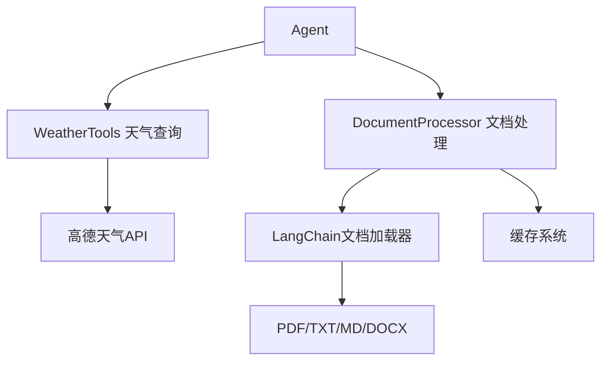

# 第16讲：工具类实现 - 天气查询与文档处理

> **本讲目标**：掌握具体工具类的实现，包括外部API集成和文档处理流程

## 一、Agent的工具体系

在第15讲中，我们学习了如何使用LangChain创建Agent。但Agent需要具体的工具才能发挥作用。本讲实现两个核心工具：

**工具系统架构**：


**为什么需要这两个工具？**

| 工具 | 作用 | 难点 | 教学价值 |
|------|------|------|----------|
| **WeatherTools** | 外部API集成示例 | API调用、错误处理、数据格式化 | 学习第三方服务集成 |
| **DocumentProcessor** | 文档处理核心 | 多格式支持、缓存优化、元数据管理 | 学习RAG数据准备 |

## 二、文件结构概览

我们有两个文件（共653行）：

**weather_tools.py（310行）**：
- `WeatherService`类：核心服务（265行）
  - 城市代码查询
  - 当前天气查询
  - 天气预报查询
  - 信息格式化
- `WeatherTools`类：工具包装（35行）

**document_processor.py（343行）**：
- `DocumentProcessor`类：完整文档处理
  - 文件上传处理
  - 多格式加载器（PDF/TXT/MD/DOCX）
  - 缓存机制（MD5哈希）
  - 批量处理
  - 统计信息

## 三、代码实现详解

我们将代码拆分成5个部分讲解。

### 第一部分：天气服务初始化和城市代码查询（weather_tools.py 1-62行）

天气API通常需要城市代码（而不是城市名称），这部分实现城市名称到代码的转换。

<details>
<summary>点击展开代码</summary>

```python
import requests
import json
import logging
from typing import Dict, Optional, Any, List
from datetime import datetime
from config.settings import Settings

logger = logging.getLogger(__name__)

class WeatherService:
    """天气查询服务类"""

    def __init__(self):
        self.settings = Settings()
        self.api_key = self.settings.WEATHER_API_KEY
        self.weather_url = self.settings.WEATHER_API_URL
        self.city_url = self.settings.WEATHER_CITY_URL

        # 城市代码缓存
        self.city_cache = {}

    def get_city_code(self, city_name: str) -> Optional[str]:
        """获取城市代码"""
        try:
            # 检查缓存
            if city_name in self.city_cache:
                return self.city_cache[city_name]

            # 构建请求URL
            url = f"{self.city_url}"
            params = {
                "keywords": city_name,
                "subdistrict": 0,
                "key": self.api_key,
                "extensions": "base"
            }

            response = requests.get(url, params=params, timeout=10)
            response.raise_for_status()

            data = response.json()

            if data.get("status") == "1" and data.get("districts"):
                # 获取第一个匹配的城市
                districts = data["districts"]
                if districts and len(districts) > 0:
                    city_code = districts[0].get("adcode")
                    if city_code:
                        # 缓存结果
                        self.city_cache[city_name] = city_code
                        logger.info(f"获取城市代码成功: {city_name} -> {city_code}")
                        return city_code

            logger.warning(f"未找到城市: {city_name}")
            return None

        except requests.RequestException as e:
            logger.error(f"获取城市代码失败: {str(e)}")
            return None
        except Exception as e:
            logger.error(f"获取城市代码出错: {str(e)}")
            return None
```

</details>

**为什么这么写？**

1. **为什么需要城市代码缓存？**
   ```python
   self.city_cache = {}  # 内存缓存
   if city_name in self.city_cache:
       return self.city_cache[city_name]
   ```
   - **性能优化**：避免重复调用城市查询API
   - **节省配额**：减少API调用次数
   - **加速响应**：缓存命中后立即返回

2. **为什么用`timeout=10`？**
   ```python
   response = requests.get(url, params=params, timeout=10)
   ```
   - 防止API无响应导致程序挂起
   - 10秒是合理的超时时间（网络正常1-2秒即可）
   - 超时后抛出`requests.Timeout`异常

3. **为什么用`raise_for_status()`？**
   ```python
   response.raise_for_status()
   ```
   - 检查HTTP状态码（200-299为成功）
   - 4xx/5xx会抛出`requests.HTTPError`
   - 统一异常处理流程

4. **为什么返回`None`而不是抛出异常？**
   ```python
   if not city_code:
       logger.warning(f"未找到城市: {city_name}")
       return None  # 而不是raise
   ```
   - 城市未找到是正常业务场景（用户输错）
   - 返回`None`让调用方决定如何处理
   - 网络错误才抛出异常

### 第二部分：当前天气和预报查询（weather_tools.py 64-145行）

这部分调用高德天气API获取天气信息。

<details>
<summary>点击展开代码</summary>

```python
    def get_current_weather(self, city_name: str) -> str:
        """获取当前天气"""
        try:
            city_code = self.get_city_code(city_name)
            if not city_code:
                return f"抱歉，无法找到城市 '{city_name}' 的信息。请检查城市名称是否正确。"

            # 构建请求URL
            params = {
                "city": city_code,
                "key": self.api_key,
                "extensions": "base"  # base=实况天气
            }

            response = requests.get(self.weather_url, params=params, timeout=10)
            response.raise_for_status()

            data = response.json()

            if data.get("status") == "1" and data.get("lives"):
                weather_info = data["lives"][0]

                # 格式化天气信息
                result = self._format_current_weather(weather_info, city_name)
                logger.info(f"获取当前天气成功: {city_name}")
                return result
            else:
                error_msg = data.get("info", "未知错误")
                logger.warning(f"获取当前天气失败: {error_msg}")
                return f"获取天气信息失败: {error_msg}"

        except requests.RequestException as e:
            error_msg = f"网络请求失败: {str(e)}"
            logger.error(f"获取当前天气失败: {error_msg}")
            return f"获取天气信息失败，请稍后重试。"
        except Exception as e:
            error_msg = f"获取当前天气出错: {str(e)}"
            logger.error(error_msg)
            return f"获取天气信息时发生错误: {str(e)}"

    def get_weather_forecast(self, city_name: str, days: int = 3) -> str:
        """获取天气预报"""
        try:
            if days < 1 or days > 7:
                return "预报天数必须在1-7天之间。"

            city_code = self.get_city_code(city_name)
            if not city_code:
                return f"抱歉，无法找到城市 '{city_name}' 的信息。请检查城市名称是否正确。"

            # 构建请求URL
            params = {
                "city": city_code,
                "key": self.api_key,
                "extensions": "all"  # all=预报天气
            }

            response = requests.get(self.weather_url, params=params, timeout=10)
            response.raise_for_status()

            data = response.json()

            if data.get("status") == "1" and data.get("forecasts"):
                forecast_info = data["forecasts"][0]

                # 格式化预报信息
                result = self._format_weather_forecast(forecast_info, city_name, days)
                logger.info(f"获取天气预报成功: {city_name}, 天数: {days}")
                return result
            else:
                error_msg = data.get("info", "未知错误")
                logger.warning(f"获取天气预报失败: {error_msg}")
                return f"获取天气预报失败: {error_msg}"

        except requests.RequestException as e:
            error_msg = f"网络请求失败: {str(e)}"
            logger.error(f"获取天气预报失败: {error_msg}")
            return f"获取天气预报失败，请稍后重试。"
        except Exception as e:
            error_msg = f"获取天气预报出错: {str(e)}"
            logger.error(error_msg)
            return f"获取天气预报时发生错误: {str(e)}"
```

</details>

**为什么这么写？**

1. **为什么参数用`extensions="base"`和`extensions="all"`？**
   ```python
   # 当前天气
   params = {"extensions": "base"}

   # 天气预报
   params = {"extensions": "all"}
   ```
   - 高德API的设计：`base`返回实况，`all`返回预报
   - 同一个接口，不同参数获取不同数据
   - 节省学习成本（只需记住一个接口）

2. **为什么返回字符串而不是dict？**
   ```python
   return result  # 字符串，而不是dict
   ```
   - **Agent需要文本**：LLM只能理解自然语言
   - 格式化后的字符串更易读：
     ```
     🏙️ **北京** 当前天气
     🌤️ **天气状况**: 晴
     🌡️ **气温**: 25°C
     ```
   - 如果返回dict，Agent还需要自己格式化

3. **为什么限制`days`在1-7天？**
   ```python
   if days < 1 or days > 7:
       return "预报天数必须在1-7天之间。"
   ```
   - 高德API只提供7天预报
   - 提前验证，避免无效请求
   - 给用户明确的反馈

### 第三部分：天气信息格式化（weather_tools.py 147-273行）

这部分将API返回的JSON转换为用户友好的文本。

<details>
<summary>点击展开代码（仅展示当前天气格式化）</summary>

```python
    def _format_current_weather(self, weather_data: Dict[str, Any], city_name: str) -> str:
        """格式化当前天气信息"""
        try:
            province = weather_data.get("province", "")
            city = weather_data.get("city", city_name)
            weather = weather_data.get("weather", "")
            temperature = weather_data.get("temperature", "")
            winddirection = weather_data.get("winddirection", "")
            windpower = weather_data.get("windpower", "")
            humidity = weather_data.get("humidity", "")
            reporttime = weather_data.get("reporttime", "")

            # 构建格式化输出
            result = f"🏙️ **{province} {city}** 当前天气\n\n"
            result += f"🌤️ **天气状况**: {weather}\n"
            result += f"🌡️ **气温**: {temperature}°C\n"
            result += f"💨 **风向风力**: {winddirection} {windpower}\n"
            result += f"💧 **湿度**: {humidity}%\n"
            result += f"📅 **发布时间**: {reporttime}\n"

            # 添加天气建议
            result += "\n💡 **温馨提示**:\n"

            if temperature and temperature.isdigit():
                temp = int(temperature)
                if temp < 10:
                    result += "• 天气较冷，请注意保暖。\n"
                elif temp > 30:
                    result += "• 天气较热，请注意防暑。\n"
                else:
                    result += "• 天气舒适，适合外出。\n"

            if humidity and humidity.isdigit():
                hum = int(humidity)
                if hum > 80:
                    result += "• 湿度较高，注意防潮。\n"
                elif hum < 30:
                    result += "• 湿度较低，注意补水。\n"

            return result

        except Exception as e:
            logger.error(f"格式化当前天气信息失败: {str(e)}")
            return f"天气数据格式化失败: {str(e)}"
```

</details>

**为什么这么写？**

1. **为什么用Emoji符号？**
   ```python
   result = f"🏙️ **{province} {city}** 当前天气\n\n"
   result += f"🌤️ **天气状况**: {weather}\n"
   result += f"🌡️ **气温**: {temperature}°C\n"
   ```
   - 提升可读性和趣味性
   - 视觉上区分不同字段
   - 用户体验更好

2. **为什么添加温馨提示？**
   ```python
   if temp < 10:
       result += "• 天气较冷，请注意保暖。\n"
   elif temp > 30:
       result += "• 天气较热，请注意防暑。\n"
   ```
   - 增加工具的价值（不只是查天气，还给建议）
   - 提升用户体验
   - 展示工具的智能性

3. **为什么用`temperature.isdigit()`判断？**
   ```python
   if temperature and temperature.isdigit():
       temp = int(temperature)
   ```
   - **防御性编程**：API返回的可能不是数字
   - 避免`int("晴")`导致异常
   - 确保代码健壮性

### 第四部分：文档处理器核心功能（document_processor.py 1-174行）

这部分实现文档上传、缓存、多格式加载。

<details>
<summary>点击展开代码（核心流程）</summary>

```python
import os
import hashlib
import logging
from typing import List, Dict, Optional, Any
from pathlib import Path
import streamlit as st
from langchain.schema import Document
from langchain.text_splitter import RecursiveCharacterTextSplitter
from langchain.document_loaders import PyPDFLoader, TextLoader, UnstructuredWordDocumentLoader
from config.settings import Settings

logger = logging.getLogger(__name__)

class DocumentProcessor:
    """文档处理器类"""

    def __init__(self):
        self.settings = Settings()
        self.cache_dir = self.settings.DATA_DIR / "document_cache"
        self.cache_dir.mkdir(parents=True, exist_ok=True)

    def _get_file_hash(self, file_content: bytes) -> str:
        """计算文件哈希值"""
        return hashlib.md5(file_content).hexdigest()

    def process_uploaded_file(self, uploaded_file) -> List[Document]:
        """处理上传的文件"""
        try:
            # 检查文件大小
            if uploaded_file.size > self.settings.MAX_FILE_SIZE:
                raise ValueError(f"文件大小超过限制: {uploaded_file.size} > {self.settings.MAX_FILE_SIZE}")

            # 读取文件内容
            file_content = uploaded_file.read()
            file_name = uploaded_file.name
            file_type = Path(file_name).suffix.lower()

            # 检查文件类型
            if file_type not in self.settings.SUPPORTED_FILE_TYPES:
                raise ValueError(f"不支持的文件类型: {file_type}")

            # 计算文件哈希
            file_hash = self._get_file_hash(file_content)
            cache_path = self._get_cache_path(file_hash, file_name)

            # 尝试从缓存加载
            cached_documents = self._load_from_cache(cache_path)
            if cached_documents is not None:
                return cached_documents

            # 处理文件
            documents = self._process_file_content(file_content, file_name, file_type)

            # 保存到缓存
            self._save_to_cache(cache_path, documents)

            logger.info(f"处理文件成功: {file_name}, 文档数量: {len(documents)}")
            return documents

        except Exception as e:
            logger.error(f"处理上传文件失败: {str(e)}")
            raise

    def _process_file_content(self, file_content: bytes, file_name: str, file_type: str) -> List[Document]:
        """处理文件内容"""
        try:
            # 创建临时文件
            temp_dir = self.settings.DATA_DIR / "temp"
            temp_dir.mkdir(parents=True, exist_ok=True)
            temp_path = temp_dir / file_name

            # 写入临时文件
            with open(temp_path, 'wb') as f:
                f.write(file_content)

            try:
                # 根据文件类型选择加载器
                if file_type == '.pdf':
                    documents = self._load_pdf(temp_path)
                elif file_type == '.txt':
                    documents = self._load_text(temp_path)
                elif file_type == '.md':
                    documents = self._load_markdown(temp_path)
                elif file_type == '.docx':
                    documents = self._load_word(temp_path)
                else:
                    raise ValueError(f"不支持的文件类型: {file_type}")

                # 添加元数据
                for i, doc in enumerate(documents):
                    doc.metadata.update({
                        'source': file_name,
                        'file_type': file_type,
                        'chunk_index': i,
                        'total_chunks': len(documents),
                        'processing_timestamp': str(Path(temp_path).stat().st_mtime)
                    })

                return documents

            finally:
                # 清理临时文件
                if temp_path.exists():
                    temp_path.unlink()

        except Exception as e:
            logger.error(f"处理文件内容失败: {str(e)}")
            raise

    def _load_pdf(self, file_path: Path) -> List[Document]:
        """加载PDF文件"""
        try:
            loader = PyPDFLoader(str(file_path))
            documents = loader.load()

            # 添加页码信息
            for i, doc in enumerate(documents):
                if 'page' not in doc.metadata:
                    doc.metadata['page'] = i + 1

            logger.info(f"加载PDF成功: {file_path.name}, 页数: {len(documents)}")
            return documents

        except Exception as e:
            logger.error(f"加载PDF失败: {str(e)}")
            raise
```

</details>

**为什么这么写？**

1. **为什么用MD5哈希？**
   ```python
   file_hash = hashlib.md5(file_content).hexdigest()
   ```
   - **去重**：相同文件不重复处理
   - **缓存键**：哈希值作为缓存文件名
   - **快速计算**：MD5性能好（安全性要求不高）

2. **为什么先写临时文件？**
   ```python
   temp_path = temp_dir / file_name
   with open(temp_path, 'wb') as f:
       f.write(file_content)

   # 使用LangChain加载器
   loader = PyPDFLoader(str(temp_path))
   ```
   - **Streamlit的限制**：`uploaded_file`是字节流，不是文件路径
   - **LangChain的要求**：`PyPDFLoader`需要文件路径
   - **临时文件桥接**：字节流 → 临时文件 → 加载器

3. **为什么用`finally`清理临时文件？**
   ```python
   try:
       documents = self._load_pdf(temp_path)
   finally:
       if temp_path.exists():
           temp_path.unlink()  # 删除临时文件
   ```
   - 无论成功或失败，都要清理
   - 避免临时文件累积占用磁盘
   - `finally`确保一定执行

4. **为什么添加元数据？**
   ```python
   doc.metadata.update({
       'source': file_name,
       'file_type': file_type,
       'chunk_index': i,
       'total_chunks': len(documents)
   })
   ```
   - **追溯性**：知道答案来自哪个文件
   - **调试**：定位问题文档
   - **展示**：在UI中显示来源

### 第五部分：文档缓存和批量处理（document_processor.py 175-343行）

这部分实现缓存机制和批量文档处理。

<details>
<parameter name="content">
<summary>点击展开代码（缓存核心）</summary>

```python
    def _load_from_cache(self, cache_path: Path) -> Optional[List[Document]]:
        """从缓存加载文档"""
        try:
            if cache_path.exists() and self.settings.CACHE_ENABLED:
                import json
                with open(cache_path, 'r', encoding='utf-8') as f:
                    cache_data = json.load(f)

                # 检查缓存是否过期
                import time
                current_time = time.time()
                cache_time = cache_data.get('timestamp', 0)

                if current_time - cache_time < self.settings.CACHE_EXPIRE_TIME:
                    # 重建Document对象
                    documents = []
                    for doc_data in cache_data.get('documents', []):
                        doc = Document(
                            page_content=doc_data['page_content'],
                            metadata=doc_data['metadata']
                        )
                        documents.append(doc)

                    logger.info(f"从缓存加载文档成功: {len(documents)} 个文档")
                    return documents
                else:
                    logger.info("缓存已过期")

        except Exception as e:
            logger.error(f"从缓存加载失败: {str(e)}")

        return None

    def _save_to_cache(self, cache_path: Path, documents: List[Document]):
        """保存文档到缓存"""
        try:
            if not self.settings.CACHE_ENABLED:
                return

            import json
            import time

            cache_data = {
                'timestamp': time.time(),
                'documents': [
                    {
                        'page_content': doc.page_content,
                        'metadata': doc.metadata
                    }
                    for doc in documents
                ]
            }

            with open(cache_path, 'w', encoding='utf-8') as f:
                json.dump(cache_data, f, ensure_ascii=False, indent=2)

            logger.info(f"保存到缓存成功: {cache_path}")

        except Exception as e:
            logger.error(f"保存到缓存失败: {str(e)}")

    def process_documents_batch(self, uploaded_files: List) -> Dict[str, Any]:
        """批量处理文档"""
        try:
            results = {
                'total_files': len(uploaded_files),
                'processed_files': 0,
                'failed_files': 0,
                'total_documents': 0,
                'errors': []
            }

            all_documents = []

            for file in uploaded_files:
                try:
                    documents = self.process_uploaded_file(file)
                    all_documents.extend(documents)
                    results['processed_files'] += 1
                    results['total_documents'] += len(documents)

                    logger.info(f"处理文件成功: {file.name}")

                except Exception as e:
                    results['failed_files'] += 1
                    error_info = {
                        'file_name': file.name,
                        'error': str(e)
                    }
                    results['errors'].append(error_info)
                    logger.error(f"处理文件失败: {file.name}, 错误: {str(e)}")

            results['all_documents'] = all_documents
            return results

        except Exception as e:
            logger.error(f"批量处理文档失败: {str(e)}")
            raise
```

</details>

**为什么这么写？**

1. **为什么需要缓存？**
   ```python
   file_hash = self._get_file_hash(file_content)
   cached_documents = self._load_from_cache(cache_path)
   if cached_documents is not None:
       return cached_documents  # 直接返回，跳过处理
   ```
   - **性能优化**：PDF解析很慢（大文件可能几秒）
   - **用户体验**：重复上传相同文件，秒级返回
   - **节省资源**：减少CPU和内存占用

2. **为什么检查缓存过期？**
   ```python
   if current_time - cache_time < self.settings.CACHE_EXPIRE_TIME:
       return cached_documents
   else:
       logger.info("缓存已过期")
   ```
   - 文档可能更新（同名文件，不同内容）
   - 默认24小时过期（`CACHE_EXPIRE_TIME = 86400`）
   - 平衡性能和新鲜度

3. **为什么缓存用JSON而不是pickle？**
   ```python
   cache_data = {
       'timestamp': time.time(),
       'documents': [
           {'page_content': doc.page_content, 'metadata': doc.metadata}
           for doc in documents
       ]
   }
   json.dump(cache_data, f)
   ```
   - **可读性**：JSON可以直接查看
   - **安全性**：避免pickle的反序列化漏洞
   - **跨平台**：JSON通用性更好

4. **为什么批量处理不抛出异常？**
   ```python
   for file in uploaded_files:
       try:
           documents = self.process_uploaded_file(file)
       except Exception as e:
           results['failed_files'] += 1
           results['errors'].append({'file_name': file.name, 'error': str(e)})
           # 继续处理下一个文件
   ```
   - **部分成功**：一个文件失败不影响其他文件
   - **错误收集**：记录所有错误，方便调试
   - **用户体验**：10个文件，9个成功1个失败，总比全失败好

## 四、完整代码总结

上面的5个部分组成了完整的工具类（653行）：

1. **天气服务初始化**（62行）：城市代码查询和缓存
2. **天气查询**（82行）：当前天气和预报
3. **天气格式化**（118行）：JSON转文本，添加建议
4. **文档处理核心**（174行）：上传、缓存、多格式加载
5. **批量处理**（169行）：缓存管理、批量文档、统计

**核心设计模式**：

| 模式 | 应用场景 | 代码位置 |
|------|---------|---------|
| **缓存模式** | 城市代码、文档处理 | `city_cache`、`_load_from_cache` |
| **工厂模式** | 根据文件类型选择加载器 | `_process_file_content` |
| **模板方法** | 统一异常处理和日志 | try-except-logger |
| **装饰器模式** | 临时文件自动清理 | try-finally |

## 五、实际使用示例

### 示例1：天气查询

```python
from services.weather_tools import WeatherTools

# 创建工具
weather = WeatherTools()

# 当前天气
result = weather.get_current_weather("北京")
print(result)
# 输出：
# 🏙️ **北京市 北京** 当前天气
# 🌤️ **天气状况**: 晴
# 🌡️ **气温**: 25°C
# ...

# 天气预报
forecast = weather.get_weather_forecast("上海", days=3)
print(forecast)
```

### 示例2：文档处理

```python
from utils.document_processor import DocumentProcessor

# 创建处理器
processor = DocumentProcessor()

# 处理单个文件（Streamlit上传）
uploaded_file = st.file_uploader("上传文档")
if uploaded_file:
    documents = processor.process_uploaded_file(uploaded_file)
    print(f"处理成功，文档数量: {len(documents)}")
    print(f"第一个文档内容: {documents[0].page_content[:100]}")
    print(f"元数据: {documents[0].metadata}")

# 批量处理
uploaded_files = st.file_uploader("上传多个文档", accept_multiple_files=True)
if uploaded_files:
    results = processor.process_documents_batch(uploaded_files)
    print(f"总文件数: {results['total_files']}")
    print(f"成功处理: {results['processed_files']}")
    print(f"失败: {results['failed_files']}")
    print(f"总文档数: {results['total_documents']}")
```

### 示例3：缓存管理

```python
processor = DocumentProcessor()

# 查看缓存统计
stats = processor.get_cache_stats()
print(f"缓存文件数: {stats['cache_files_count']}")
print(f"缓存总大小: {stats['cache_total_size_mb']} MB")

# 清空缓存
processor.clear_cache()
```

## 六、在Agent中集成工具

回顾第15讲，我们学习了如何在Agent中使用工具。现在结合本讲的具体实现：

```python
from models.agent import AgenticRAGAgent
from services.weather_tools import WeatherTools
from services.vector_store import VectorStoreService

# 创建工具
weather_tools = WeatherTools()
vector_store = VectorStoreService()

# 定义工具函数
def document_search(query: str) -> str:
    """搜索文档中的相关信息"""
    results = vector_store.search(query, top_k=3)
    return "\n".join([r['content'] for r in results])

# 创建Agent
agent = AgenticRAGAgent(
    model_name="qwen2.5:7b",
    tools=[
        weather_tools.get_current_weather,  # 天气查询工具
        document_search                      # 文档搜索工具
    ]
)

# 测试
response = agent.generate_response("北京天气怎么样？")
print(response)
# Agent会自动调用weather_tools.get_current_weather("北京")
```

## 七、本讲总结

我们完成了两个核心工具类的实现：

1. **WeatherTools**（310行）：
   - 高德天气API集成
   - 城市代码查询和缓存
   - 当前天气和预报查询
   - Markdown格式化输出
   - 温馨提示生成

2. **DocumentProcessor**（343行）：
   - 多格式文档加载（PDF/TXT/MD/DOCX）
   - MD5哈希缓存机制
   - 临时文件管理
   - 批量处理和错误收集
   - 元数据管理

**关键技术点**：
- 外部API调用（requests + timeout + raise_for_status）
- 缓存优化（城市代码缓存、文档缓存）
- 临时文件管理（finally清理）
- 批量处理（部分失败不影响全局）
- 元数据管理（追溯性和调试）

**最佳实践**：
- 超时设置（10秒）
- 异常分类（网络错误 vs 业务错误）
- 防御性编程（`isdigit()`检查）
- 日志记录（成功、失败、警告）
- 用户友好的错误信息

---

**下一讲预告**

第17讲：辅助工具类 - UI组件、聊天历史与装饰器

我们将学习剩余的辅助工具类：
- UI组件封装（st.success/info/warning/error）
- 聊天历史管理（CSV导出、持久化）
- 装饰器模式（error_handler、log_execution）
- 完整的ui_components.py、chat_history.py、decorators.py实现（约200行代码详解）
